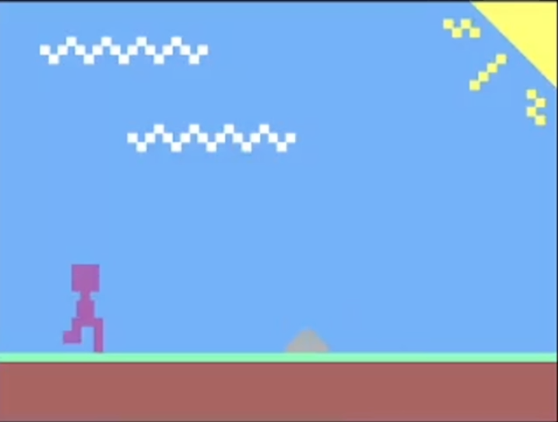
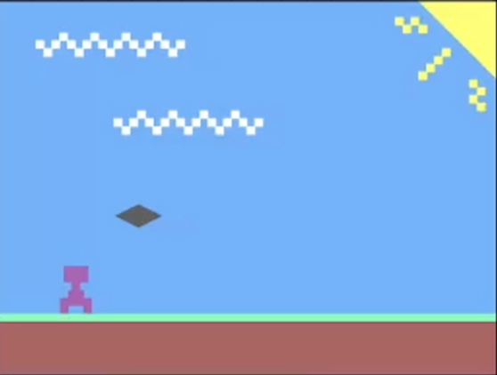

# Little Runner
## A game where you run forever and avoid objects.
### Keep your tiny runner alive for as long as possible.

---

## Description

Little Runner is a hardware-based FPGA game designed for the Bitstream Hack Club YSWS program. In this game, players control a running character and try to survive for as long as possible. They must avoid spikes and darts by jumping and crouching whilst the speed of these attack continously ramp up.

## Video Demo

## Next Steps

Whilst this game is very refined and well-done, there still exist some improvements that can be made to better the user expereince in the future. The main character can be made to be dual-color to increase the aesthetic appeal of the game and the overall game can be better optimized to improve FPS (gameplay runs at ~30 FPS and end screen runs at ~10 FPS).

## Screenshots

