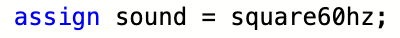
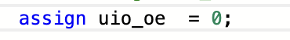

Hour 1-2

Date: 09/12/2025 (mm/dd/yyyy)

Time range: 8:30 PM - 10:30 PM

Description: I first began today by trying to setup a basic diplay demo with 3 vertical bars of different grey-scale colors inside of a simple game loop to ensure all aspecs of the basic display functionality was working. I then worked on getting the game controller working by making it alternate the colors of the greyscale bars every time the "up" key was pressed. Then, I attempted to add a simple sound tone to consistently play at a given frequency. However, this proved to be wildly difficult with me having to resort to information provided from the Slack, the FPGA's datasheet, trial & error, the tutorials and the Music demo to try to better understand how 1-bit audio is used in this specific project. I also tried studying and learning the way 1-bit audio worked and tried implementing that as well. I even tried swapping the colors of the vertical bars at the same frequency as the audio to ensure I was getting a audio loop at a human-percievable frequency. In my desperation, I even tried using the (VGA Playground Editor)[https://vga-playground.com/] from which the Bitstream editor was derived from to see if that may be the issue. But to no avail. I could not get it to work and will have to continue trying to do so tomorrow. If I get time, after I get the audio to work, I should clean up the codebase and comment everything for clarity before implementing the bulk of the complex game logic. Images of the demos, attempts and the jourey can be found below.

Hour 3

Date: 09/13/2025 (mm/dd/yyyy)

Time range: 8:30 AM - 9:30 AM

Description: Today I continued attempting to solve the audio issue. I began by trying and changing the counter values to see if changing the frequency would work. Unfortunately that did not work. I then tried modifying the types of operators used to flip the bit value of the sound wave to see if maybe that was the issue. But again, this did not work. I even tried simplifying the music demo to a single tone and copied the line of code into my project.

This did not work for me which led me to become curious of the differences in setup between my prject and the music demo. This is because identical code should provide identical results if the conditions are the same leading me to believe that I had a slight change in the way I intialized my code. Lo and behold, this was in fact the issue and I was finally able to get a solid tone to play from the game's audio. This means that I now have all the tools necessary to begin programming the game logic itself and plan on beginning that in the next hour. The first step before that, however, is to clean up the code and comment as necessary because it currently looks very messy. The image of the minute set-up change I had to make can be found below.

Hour 4

Date: 09/13/2025 (mm/dd/yyyy)

Time range: 10:00 AM - 11:00 AM

Description: I spent this next hour wokring on building out the fundemental blocks of the game. After cleaning up the codebase and commenting for clarity, I then began by making a list of constants to control the finer details of te game and refine them afterwards without changing a large chunk of game logic. To do this, I started by generating a nice [color palette](https://coolors.co/522b29-37ff8b-51d6ff-8d9ec6-a06b9a) and converting it into 2-bit RGB values for my game. I then determined positions, speeds and acceleration values and made them constants as well. I then worked on making a simple audio control system to play beeps as necessary. I then worked to make the display logic in the game loop to actually display the sky, grass and dirt along with a temporary red box representing the main character. An image of the work completed at this point can be found below.

